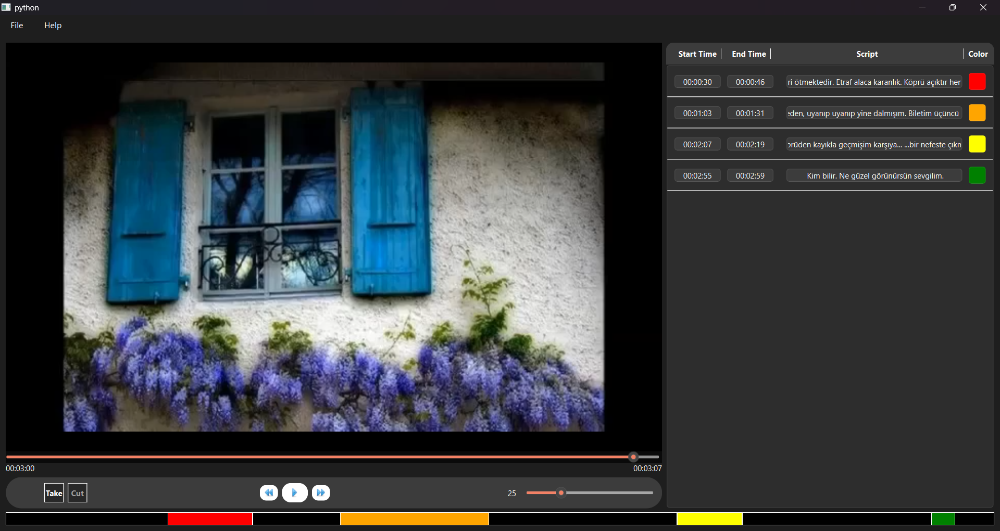
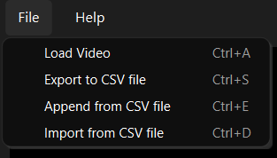

## Media Player Bar

**Take Button**: Marks the start of a cut. (Shortcut: CTRL+X)  
**Cut Button**: Marks the end of a cut, creates the cut, and displays it in the list on the right. (Shortcut: CTRL+C)

Other buttons function as standard media player controls. Quick tips:  

- 10-second forward button → Shortcut: Right Arrow  
- 10-second backward button → Shortcut: Left Arrow  
- Play/Pause button → Shortcut: Space  

## Segmented Bar

Located below the media player, this bar shows all the cuts taken by the user as segments.  

- **Single click** on a segment → Jumps to its start time and plays the media  
- **Double click** → Jumps to its start time and pauses the media  

## Cut List


Located on the left side of the screen, it displays each cut with its start/end time, transcript, and color.  

- **Clicking start/end times** → Opens a dialog to adjust the time if needed and restarts the transcription.  
- **Clicking the script** → Opens a dialog to edit the transcript if necessary.  
- **Clicking color buttons** → Works the same way as clicking on segments in the segmented bar.  

## Menu

### File



- **Load Video**: Loads a video for labeling and transcription.  
- **Export to CSV**: Saves all cuts as a CSV file containing Start, End, and Transcription columns.  
- **Import from CSV**: Loads a CSV file and displays its contents in the cut list, replacing existing cuts.  
- **Append from CSV**: Loads a CSV file and appends its contents to the existing cuts in the list.  

### Help

Provides contact information for user support:  
- **Email**: erdem.mirzak@gmail.com

## Extra tips:

- Exiting the program while transcriptions are running may trigger the error:
```bash
 "QThread: Destroyed while thread '' is still running" 
```
and cause temporary .wav files to remain undeleted.
- The program is tested for Turkish; transcription in other languages has not been verified.
- In main.py, 33th line:
```bash
self.model = whisper.load_model("medium")
```
You can change the model to "tiny", "small", or "large" to adjust the speed and accuracy trade-off.